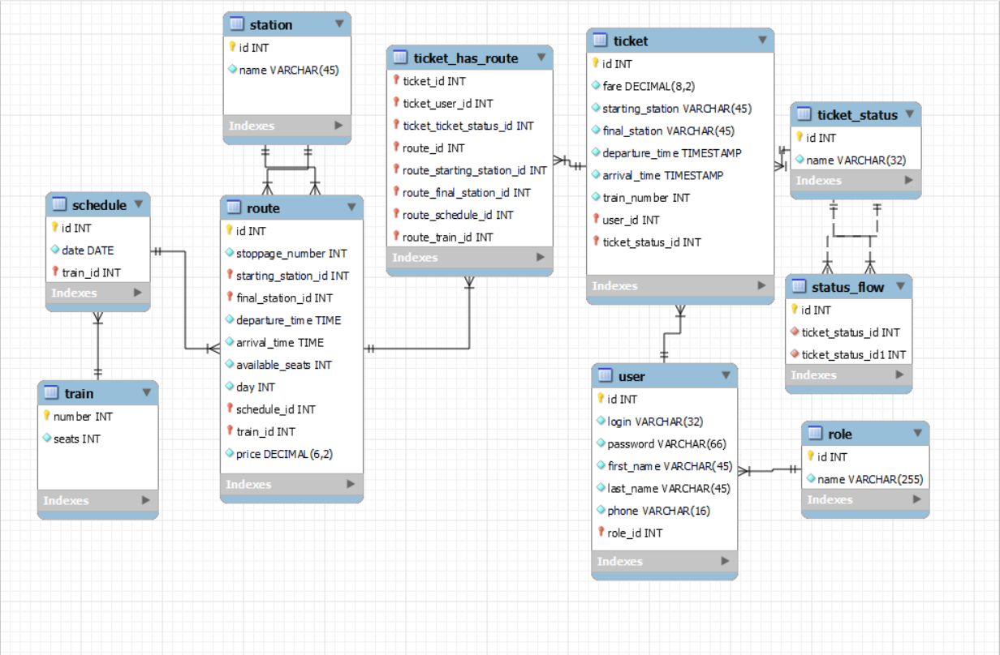

# Railway-ticket-office-webapp

Servlet-API, JDBC, MySql 8.0.30, Apache Tomcat 9.0.67, JSP...

PROJECT DESCRIPTION

The task of the final project is to develop a web application that supports the functionality according to the task
variant. There are roles:
         
         Administrator,
         User.

The administrator can add / delete / edit the list of Stations and Railway Routes between
them. The route contains information as:
- starting station and departure time;
- final station and time of arrival.

The user can search for routes between stations that interest him. The result of the search is
a list of trains, each string of which contains:
- train number;
- time / date and station of departure;
- travel time;
- time / date and station of arrival;
- number of available seats;
- travel cost;
- link to the corresponding route view page (user can view route information).

If the user is registered in the system, he must be able to buy a ticket for the selected route
on the specified date (subject to availability).

Database model:

